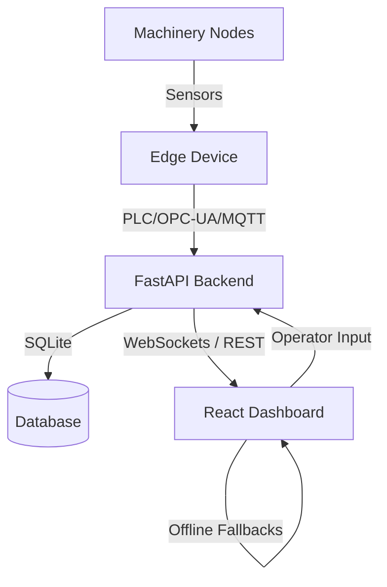

# EdgeTwin AI — Digital Twin & Decision Intelligence

EdgeTwin AI is an edge-first, offline-capable predictive maintenance and digital twin dashboard for factory machinery. It integrates high-fidelity real-time telemetry tracking with a prescriptive optimization simulator, enabling factory operators to make cost-efficient maintenance decisions. 

## Key Features

1. **State-of-the-Art Factory Floor Visualizer**: Real-time status tracking, metric indicators (temperature, vibration, load, RPM) for 6 major assets (CNC Mill, Injection Molder, 6-Axis Robot, Air Compressor, Conveyor Belt, Hydraulic Press).
2. **AI-Driven Predictive Maintenance**: Built-in estimators for failure probability, remaining useful life (RUL), and Explainable AI (XAI) feature importances.
3. **Prescriptive Decision Simulator**: Compares different mitigation choices (e.g., immediate repair today vs. scheduled shutdown) and estimates avoided financial loss in Rupee (₹).
4. **Offline Resilience Engine**: Core actions run local JS fallback algorithms automatically if the FastAPI edge server becomes unreachable, maintaining full cockpit interactivity.
5. **AI Factory Copilot**: Natural language assistant answering questions about equipment diagnostics, priority alerts, financial ROI, and sandbox scenarios.

## Technical Architecture

The architecture consists of:
- **Frontend**: React 19, Vite, Tailwind CSS, Recharts, Lucide Icons, and client-side simulation fallback engines.
- **Backend (Edge Server)**: Python / FastAPI, SQLite, uvicorn web server, background telemetry simulation thread, and WebSocket broadcaster.



## Getting Started

### Prerequisites

- Node.js (v18+)
- Python 3.10+

### Installation

1. Clone the repository:
   ```bash
   git clone https://github.com/obstinix/EdgeTwinAiV1.git
   cd EdgeTwinAi
   ```

2. Install frontend dependencies:
   ```bash
   npm install
   ```

3. Install python backend dependencies:
   ```bash
   pip install -r requirements.txt
   ```

### Running Locally

To run both services concurrently during local development:

1. **Start the FastAPI Backend**:
   ```bash
   npm run backend
   ```
   This boots the backend at `http://127.0.0.1:8000`.

2. **Start the Vite Frontend**:
   ```bash
   npm run dev
   ```
   This boots the frontend development server. Open `http://localhost:5173` in your browser.

## Deployment Story & TRL

This prototype runs in **TRL 5** (validation in a simulated industrial environment). It features full local client-side offline fallbacks ensuring no diagnostic data drops occur during connection issues. In production (TRL 8), the dashboard connects to live OPC-UA/MQTT PLC telemetry streams.
